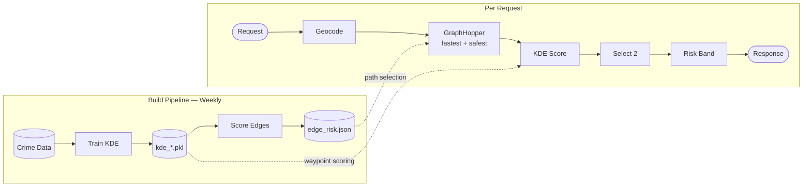
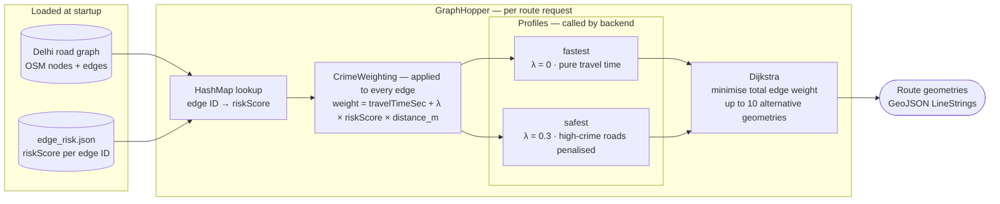

# Crime-Aware Route Recommender — Architecture

```mermaid
flowchart LR

    subgraph BUILD["Build Pipeline — Weekly"]
        DB[(Crime Data)] --> TRAIN[Train KDE] --> KDE[(kde_*.pkl)] --> EDGE[Score Edges] --> EJSON[(edge_risk.json)]
    end

    subgraph RUNTIME["Per Request"]
        REQ([Request]) --> GEO[Geocode] --> GH[GraphHopper\nfastest + safest] --> SCORE[KDE Score] --> PICK[Select 2] --> BAND[Risk Band] --> RESP([Response])
    end

    KDE -.->|waypoint scoring| SCORE
    EJSON -.->|path selection| GH
```

---

## How GraphHopper Works

```mermaid
flowchart LR

    subgraph STARTUP["Loaded at startup"]
        OSM[(Delhi road graph\nOSM nodes + edges)]
        JSON[(edge_risk.json\nriskScore per edge ID)]
    end

    subgraph GH["GraphHopper — per route request"]
        direction TB
        LOOKUP["HashMap lookup\nedge ID → riskScore"]
        WEIGHT["CrimeWeighting — applied to every edge\nweight = travelTimeSec + λ × riskScore × distance_m"]

        subgraph PROFILES["Profiles — called by backend"]
            F["fastest\nλ = 0  · pure travel time"]
            S["safest\nλ = 0.3 · high-crime roads penalised"]
        end

        ALG["Dijkstra\nminimise total edge weight\nup to 10 alternative geometries"]
    end

    ROUTES(["Route geometries\nGeoJSON LineStrings"])

    OSM --> LOOKUP
    JSON --> LOOKUP
    LOOKUP --> WEIGHT
    WEIGHT --> F & S
    F & S --> ALG
    ALG --> ROUTES
```
