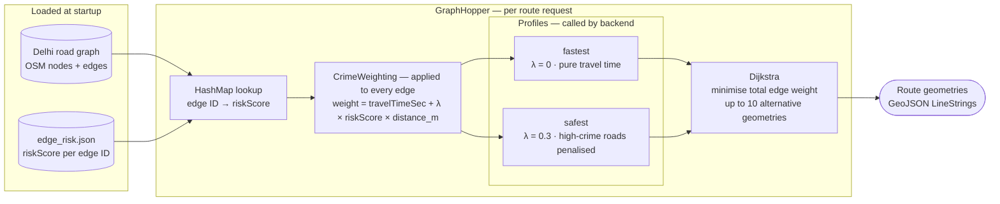
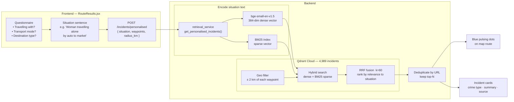
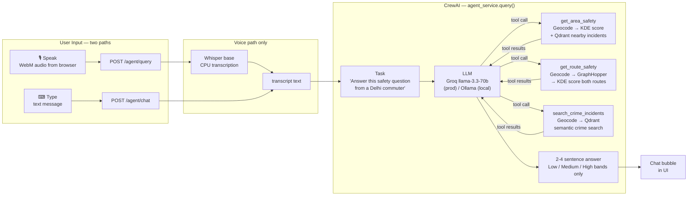

# Crime-Aware Route Recommender — Architecture

```mermaid
flowchart LR

    subgraph BUILD["Build Pipeline — Weekly"]
        DB[(Crime Data)] --> TRAIN[Train KDE] --> KDE[(kde_*.pkl)] --> EDGE[Score Edges] --> EJSON[(edge_risk.json)]
    end

    subgraph RUNTIME["Per Request"]
        REQ([Request]) --> GEO[Geocode] --> GH[GraphHopper\nfastest + safest] --> SCORE[KDE Score] --> PICK[Select 2] --> BAND[Risk Band] --> RESP([Response])
    end

    KDE -.->|waypoint scoring| SCORE
    EJSON -.->|path selection| GH
```

---

## How GraphHopper Works

```mermaid
flowchart LR

    subgraph STARTUP["Loaded at startup"]
        OSM[(Delhi road graph\nOSM nodes + edges)]
        JSON[(edge_risk.json\nriskScore per edge ID)]
    end

    subgraph GH["GraphHopper — per route request"]
        direction TB
        LOOKUP["HashMap lookup\nedge ID → riskScore"]
        WEIGHT["CrimeWeighting — applied to every edge\nweight = travelTimeSec + λ × riskScore × distance_m"]

        subgraph PROFILES["Profiles — called by backend"]
            F["fastest\nλ = 0  · pure travel time"]
            S["safest\nλ = 0.3 · high-crime roads penalised"]
        end

        ALG["Dijkstra\nminimise total edge weight\nup to 10 alternative geometries"]
    end

    ROUTES(["Route geometries\nGeoJSON LineStrings"])

    OSM --> LOOKUP
    JSON --> LOOKUP
    LOOKUP --> WEIGHT
    WEIGHT --> F & S
    F & S --> ALG
    ALG --> ROUTES
```

---

## How Personalised Incidents Work

```mermaid
flowchart LR

    subgraph UI["Frontend — RouteResults.jsx"]
        Q["Questionnaire\n• Travelling with?\n• Transport mode?\n• Destination type?"] --> SIT["Situation sentence\ne.g. 'Woman travelling alone\nby auto to market'"]
        SIT --> CALL["POST /incidents/personalised\n{ situation, waypoints, radius_km }"]
    end

    subgraph BACKEND["Backend"]
        CALL --> RS["retrieval_service\nget_personalised_incidents()"]

        subgraph EMBED["Encode situation text"]
            RS --> DENSE["bge-small-en-v1.5\n384-dim dense vector"]
            RS --> SPARSE["BM25 index\nsparse vector"]
        end

        subgraph QDRANT["Qdrant Cloud — 4,989 incidents"]
            GEO["Geo filter\n± 2 km of each waypoint"]
            SEARCH["Hybrid search\ndense + BM25 sparse"]
            RRF["RRF fusion  k=60\nrank by relevance to situation"]
        end

        DENSE & SPARSE --> SEARCH
        GEO --> SEARCH
        SEARCH --> RRF
        RRF --> DEDUP["Deduplicate by URL\nkeep top-N"]
    end

    DEDUP --> MAP["Blue pulsing dots\non map route"]
    DEDUP --> CARDS["Incident cards\ncrime type · summary · source"]
```

---

## How the Voice / Text Agent Works

```mermaid
flowchart LR

    subgraph INPUT["User Input — two paths"]
        MIC["🎙 Speak\nWebM audio from browser"] --> VOI["POST /agent/query"]
        TXT["⌨ Type\ntext message"] --> CHT["POST /agent/chat"]
    end

    subgraph TRANSCRIBE["Voice path only"]
        VOI --> WH["Whisper base\nCPU transcription"]
        WH --> TR["transcript text"]
    end

    CHT --> TR

    subgraph CREWAI["CrewAI — agent_service.query()"]
        TR --> TASK["Task\n'Answer this safety question\nfrom a Delhi commuter'"]
        TASK --> LLM["LLM\nGroq llama-3.3-70b\n(prod) / Ollama (local)"]

        LLM -->|"tool call"| T1["get_area_safety\nGeocode → KDE score\n+ Qdrant nearby incidents"]
        LLM -->|"tool call"| T2["get_route_safety\nGeocode → GraphHopper\n→ KDE score both routes"]
        LLM -->|"tool call"| T3["search_crime_incidents\nGeocode → Qdrant\nsemantic crime search"]

        T1 & T2 & T3 -->|"tool results"| LLM
        LLM --> ANS["2-4 sentence answer\nLow / Medium / High bands only"]
    end

    ANS --> BUBBLE["Chat bubble\nin UI"]
```
